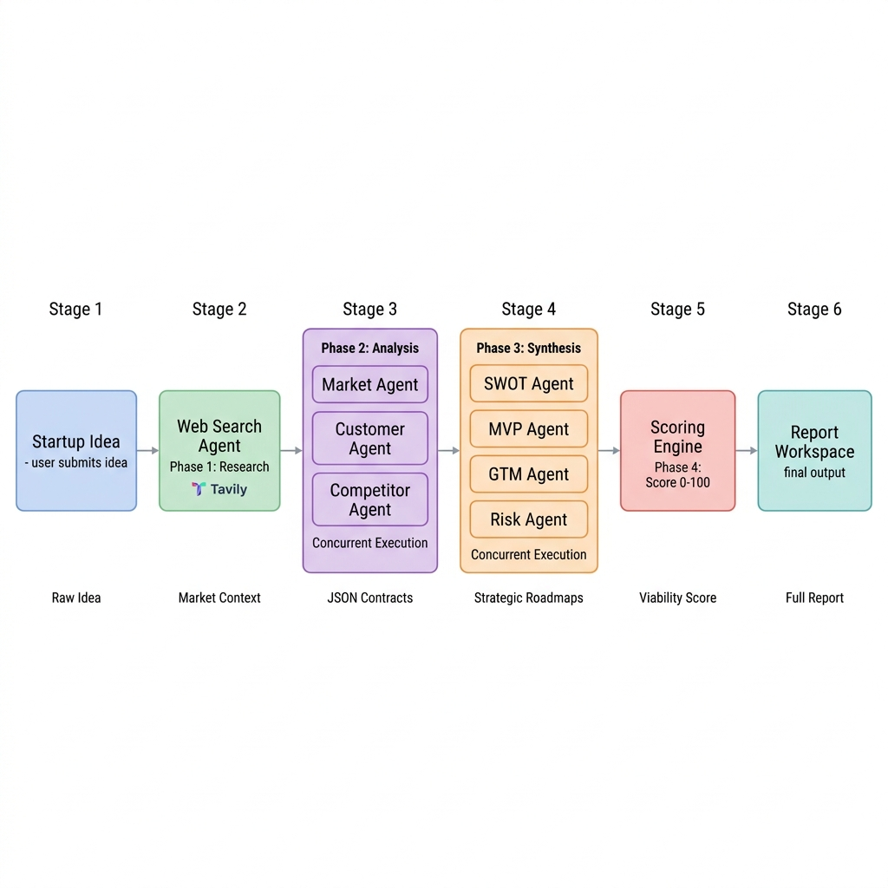
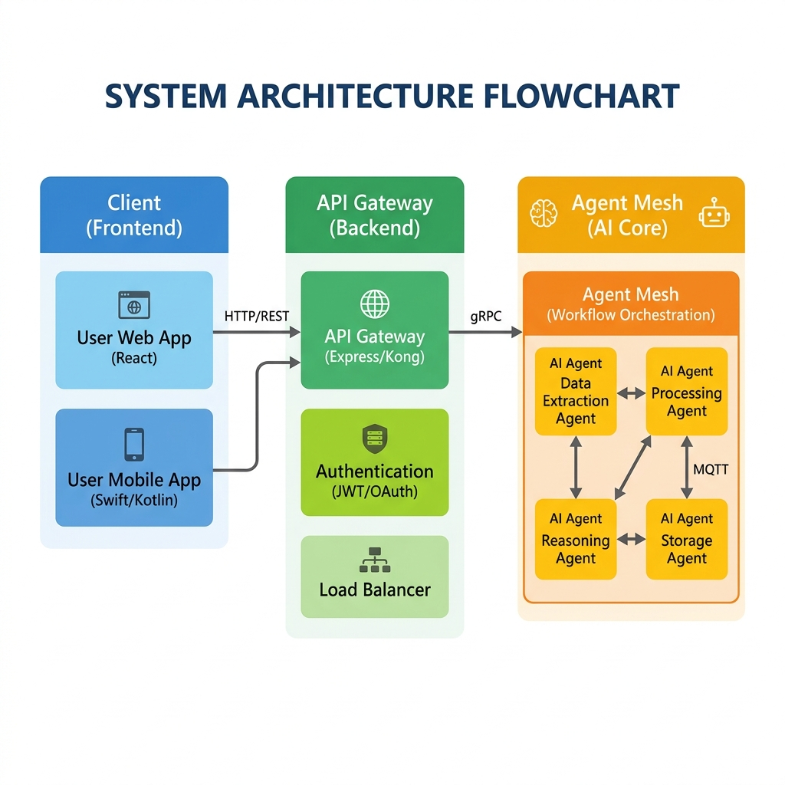

<div align="center">
  <h1> VentureLens</h1>
  <p><b>Development of AI Based Startup Idea Validator with Market Analysis Assistance</b></p>
  
  [](#)
  [](#)
  [](#)
  [](#)
</div>

<br/>

> **VentureLens** is a production-grade, asynchronous, multi-agent intelligence platform designed to transform raw startup ideas into comprehensive, investor-ready due diligence reports. Powered by a decentralized Peer-to-Peer (P2P) agent mesh network, it researches, analyzes, and strategizes using live web data.

---

## 🌟 What is VentureLens?

VentureLens is an AI-powered startup validation platform designed to help founders, innovators, incubators, and early-stage teams evaluate business ideas before investing significant time and resources.

Instead of relying on generic AI responses, VentureLens performs **structured analysis** across multiple business dimensions, generating comprehensive reports that help users understand:

- 📈 **Market opportunities** & growth potential
- 🎯 **Customer segments** & user personas
- 🏆 **Competitive landscape** & market differentiation
- 🛠️ **Product feasibility** & core MVP features
- 🚀 **Go-To-Market (GTM) strategy** & launch channels
- ⚠️ **Business risks** (operational, market, technical)
- ⚡ **Strategic SWOT analysis** (Strengths, Weaknesses, Opportunities, Threats)
- 💯 **Startup viability scoring**

The platform elegantly combines intelligent orchestration, specialized analysis agents, validation frameworks, report generation, and conversational AI into a single, cohesive startup intelligence workspace.

---

## 🎯 Why VentureLens?

Launching a startup is one of the highest-risk activities in business. Many founders struggle to answer critical questions:

> *Is there a real market? Who are my exact customers? What problem am I truly solving? How competitive is the space? What should I build first? What risks could kill the idea?*

Traditional validation requires extensive market research, competitor analysis, customer discovery, strategic planning, and business consulting—processes which often take weeks or months and cost thousands of dollars.

**VentureLens compresses this entire process into a structured, AI-assisted workflow, executing in mere seconds.**

---

## 🧠 Platform Capabilities

For every startup idea, the VentureLens intelligence engine generates:

| Capability | Scope of Analysis |
| :--- | :--- |
| 📊 **Market Analysis** | Evaluates market opportunities, industry trends, growth potential, and market positioning. |
| 👥 **Customer Analysis** | Identifies target audiences, customer personas, user pain points, and distinct value propositions. |
| 🏆 **Competitor Analysis** | Analyzes direct/indirect competitors, competitive advantages, and market differentiation opportunities. |
| ⚡ **SWOT Analysis** | Generates strategic Strengths, Weaknesses, Opportunities, and Threats for the proposed startup idea. |
| 🛠 **MVP Planning** | Defines core features, product priorities, initial release strategy, and development recommendations. |
| 📣 **GTM Strategy** | Provides launch approaches, acquisition channels, growth recommendations, and positioning strategies. |
| ⚠ **Risk Assessment** | Evaluates overarching business risks, market risks, operational risks, and product risks. |
| 📈 **Startup Scoring** | Generates a structured startup viability score based on market attractiveness, product feasibility, competitive position, and strategic readiness. |
| 🤖 **Vera AI Co-Founder** | Interacts with your analysis through a conversational AI experience. Ask follow-up questions, explore recommendations, understand report findings, and retrieve contextual insights. |
| 📄 **Report Generation** | Generates professional exports including Executive reports (PDF), Startup assessments, and Business intelligence summaries (PPTX). |

---

## 🔄 How VentureLens Works

<div align="center">
  
</div>

<br/>

1. **Submit an Idea**: Users describe their startup concept, product, or business idea via the dashboard.
2. **Research & Validation**: The platform gathers supporting live-web information and context for analysis (`Tavily API`).
3. **Multi-Agent Evaluation**: Specialized P2P agents concurrently evaluate different business dimensions (Market, Customer, Competitor, SWOT, MVP, GTM, Risk).
4. **Strategic Synthesis**: Agent results are consolidated into a unified, validated business intelligence report.
5. **Startup Scoring**: The dynamic scoring engine evaluates overall venture viability.
6. **Workspace & Collaboration**: Users explore the highly structured results through the VentureLens React workspace.
7. **Vera AI Interaction**: Users engage with their specific report through the conversational RAG AI.
8. **Export & Share**: Generate downloadable PDF and PPTX business documentation in one click.

---

## 🏗 Architecture Overview

VentureLens follows a deeply modular, decoupled architecture designed around independent intelligence services and reusable business analysis components.

<div align="center">
  
</div>

<br/>

### Core Engineering Layers

- **🎨 Frontend Layer**: Responsible for User experience, Dashboards, Workspace management, Report visualization, and WebSockets for Vera AI interactions.
- **⚡ API Layer**: Provides async Analysis endpoints, Workspace operations, Report management, and Export functionality.
- **⚙️ Orchestration Layer**: Coordinates concurrent Agent execution, Data flow, the Validation pipeline, and Report assembly.
- **🧠 Intelligence Layer**: Contains specialized business analysis agents (Market Agent, Customer Agent, Competitor Agent, SWOT Agent, MVP Agent, GTM Agent, Risk Agent).
- **🛡️ Validation Layer**: Responsible for strict Pydantic output validation, data consistency checks, structured responses, and hallucination quality control.
- **📚 Knowledge Layer**: Supports Retrieval systems (Qdrant), Context management, Historical report intelligence, and Conversational interactions.
- **📄 Export Layer**: Generates dynamically formatted PDF reports, Presentation-ready documents, and Business summaries.

---

## 🗂 Project Structure

```text
VentureLens
│
├── backend/
│   ├── api/             # FastAPI REST & WebSocket Routes
│   ├── agents/          # 10 Specialized LLM Agents (e.g., market_agent.py, risk_agent.py)
│   ├── contracts/       # Pydantic v2 Schemas enforcing rigid data shapes
│   ├── crew/            # Orchestrator (orchestrator.py manages async mesh)
│   ├── guardrails/      # Manager ensuring factual & schema consistency
│   ├── rag/             # Qdrant Vector Store integration & Embeddings
│   ├── export/          # PDF (fpdf2) and PPTX (python-pptx) generation
│   └── database/        # SQLAlchemy ORM, Alembic migrations, SQLite bindings
│
├── frontend/
│   ├── src/components/  # Modular React UI (Report Sections, Charts, Modals)
│   ├── src/pages/       # Route Views (Dashboard, Workspace, VeraChat)
│   └── src/contexts/    # React Context APIs for state management
│
└── docs/                # Extended architectural documentation
```

---

## 🛠 Technology Stack

**Frontend**  
`React 18` • `Vite` • `JavaScript` • `Tailwind CSS` • `Framer Motion`

**Backend**  
`FastAPI` • `Python 3.11` • `AsyncIO` • `SQLAlchemy` • `Alembic`

**AI & Intelligence**  
`OpenRouter` • `Tavily Search` • `Retrieval-Augmented Generation (RAG)` • `P2P Agent-Based Analysis` • `Structured Validation`

**Data & Storage**  
`SQLite` • `Qdrant Vector Storage` • `JSON-Based Intelligence Contracts`

---

## 🚀 Getting Started

### 1. Backend Setup
```bash
cd backend
python -m venv venv
source venv/bin/activate
pip install -r requirements.txt
uvicorn app:app --reload
```

### 2. Frontend Setup
```bash
cd frontend
npm install
npm run dev
```

---

## ⚙ Environment Configuration

Create a `.env` file in the root backend directory:

```env
OPENROUTER_API_KEY=your_openrouter_key
TAVILY_API_KEY=your_tavily_key
SECRET_KEY=your_secure_encryption_secret
```

---

## 🌐 Deployment

The platform is designed to be cloud-agnostic and can be deployed rapidly using:
- **Render** / **Railway** (For the FastAPI Backend & SQLite/PostgreSQL)
- **Vercel** / **Netlify** (For the Vite Frontend build)

Deployment configuration files (`render.yaml`) are included natively within the repository.

---

## 🔮 Future Roadmap

- [ ] Enhanced startup scoring models & deeper financial projections
- [ ] Expanded market intelligence capabilities (Live SEC filings integration)
- [ ] Collaborative workspaces (Multi-tenant JWT Auth)
- [ ] Additional export formats (Excel Financial Models)
- [ ] Advanced RAG integrations (Custom user PDF uploads)
- [ ] Extended business strategy modules (Pricing strategy, SEO strategy)
- [ ] Improved agent coordination (Auto-correcting agent debates)
- [ ] Enterprise deployment support (Docker Swarm/Kubernetes)

---

## 👥 Contributors

**Team Beta**
- Shreya R
- Neha
- Abhipsha
- Lahari

---
<div align="center">
  <p>Released under the <a href="LICENSE">MIT License</a>.</p>
  <p><b>VentureLens</b> — <i>From idea to insight. From insight to execution. 🚀</i></p>
</div>
