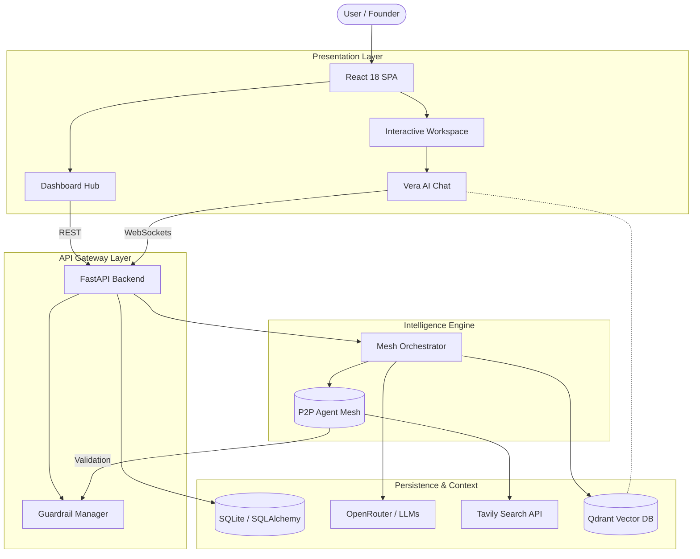
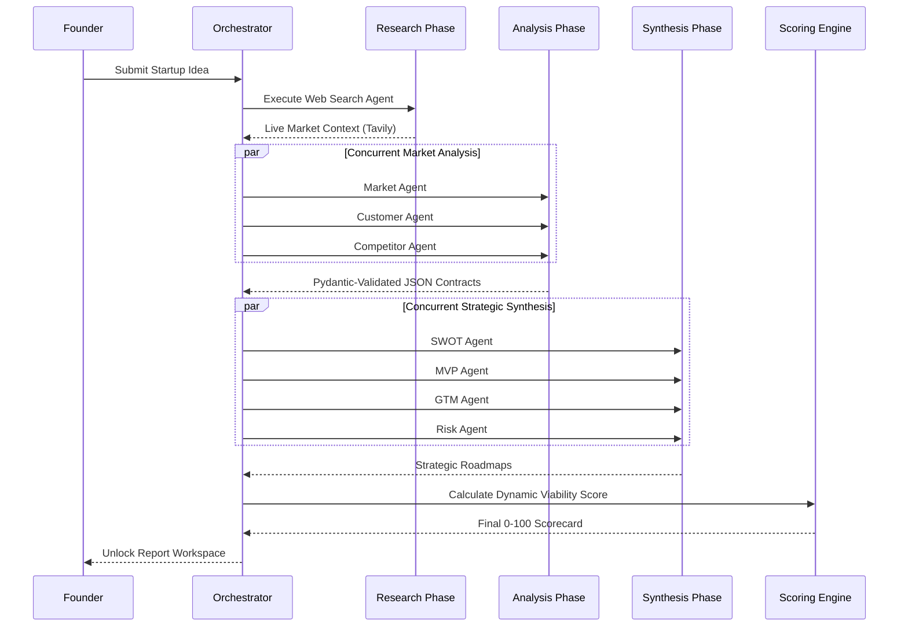
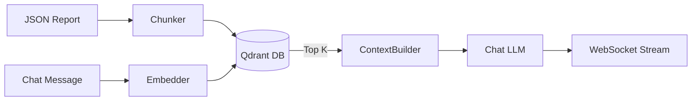

<div align="center">
  <h1>🚀 VentureLens</h1>
  <p><b>Development of AI Based Startup Idea Validator with Market Analysis Assistance</b></p>
  
  [](https://opensource.org/licenses/MIT)
  [](#)
  [](#)
  [](#)
  [](#)
</div>

<br/>

> **VentureLens** is a production-grade, multi-agent AI platform that transforms raw, back-of-the-napkin startup ideas into comprehensive, investor-ready due diligence reports in seconds. 

---

## 📖 The Vision: Democratizing Startup Due Diligence

**The Problem:** Traditional startup validation is painfully slow, inherently biased, and heavily reliant on static, generic advice. Founders spend weeks piecing together market research, while investors waste hours evaluating fundamentally flawed business models. Generic LLMs (like ChatGPT) hallucinate market data and lack the multi-step strategic reasoning required for true due diligence.

**The Solution:** VentureLens automates the entire validation lifecycle. By orchestrating a **decentralized Peer-to-Peer (P2P) Agent Mesh**, VentureLens mimics a board of specialized experts—Market Analysts, Risk Assessors, and Product Strategists. It continuously searches the live web for ground-truth data, cross-references claims, and generates a rigorously validated business model scorecard, culminating in interactive strategy sessions with an AI Co-Founder.

---

## 🌐 Live Demo & Deployment

> **🟢 Live Platform:** [Deploying Soon - Placeholder URL](#)

*(The platform is configured for scalable deployment on Render and Vercel. See the [Deployment](#-deployment-guide) section below.)*

---

## 🏗️ High-Level System Architecture

VentureLens operates on a decoupled client-server architecture, utilizing WebSockets for real-time streaming and REST APIs for stateless operations. 



---

## 🧠 End-to-End Intelligence Workflow

How does a raw idea become a 20-page investment report? VentureLens uses a highly structured orchestration pipeline.



---

## ⚡ Core Features & Technical Implementation

VentureLens isn't just an API wrapper; it's a deeply engineered orchestration platform.

### 1. Peer-to-Peer (P2P) Multi-Agent Mesh
Unlike linear agent chains that suffer from bottlenecking, our **Agent Mesh** allows agents to execute concurrently and share context graph-style.
- **Business Value:** Reduces report generation time by 60% while increasing depth of insight.
- **Implementation:** Built on `asyncio` and `FastAPI` background tasks. Agents strictly communicate via Pydantic v2 schemas to ensure perfect data serialization.

### 2. Comprehensive Intelligence Layers
- **Market & Competitor Layers:** Extracts TAM/SAM/SOM, identifies direct/indirect competitors, and maps market saturation.
- **Customer Layer:** Profiles user personas, pain points, and willingness-to-pay.
- **Strategic Layers (SWOT, MVP, GTM, Risk):** Translates research into actionable business strategies, including risk mitigation and launch channels.
- **Startup Scoring Engine:** Dynamically calculates a viability score based on industry-specific risk matrices.

### 3. Vera: Your AI Co-Founder (RAG System)
- **Business Value:** A static report is dead. Vera allows founders to interrogate their own business plan dynamically.
- **Implementation:** Uses **Qdrant Vector DB**. The generated JSON report is chunked, embedded, and stored in-memory. When a user asks a question, Vera uses Retrieval-Augmented Generation (RAG) to provide hyper-contextualized answers over a WebSocket connection.



### 4. Guardrails & Hallucination Prevention
- **Implementation:** Every agent output is piped through a `GuardrailManager`. It enforces schema matching, numeric consistency, and executes fallback retries before corrupt data can enter the database.

### 5. Export & Workspace System
- **PDF & PPTX Engine:** One-click conversion of the JSON report into professional pitch decks (via `python-pptx`) and executive summaries (via `fpdf2`).
- **Interactive Workspace:** A stunning, Framer Motion-powered glassmorphic UI where founders can navigate their strategic roadmaps.

---

## 📁 Project Structure & Engineering

VentureLens is organized into deeply decoupled modules following service-oriented architecture principles.

```text
VentureLens/
├── backend/
│   ├── api/             # FastAPI Routers (REST & WebSockets)
│   ├── agents/          # LLM Agent definitions (Prompts, Persona configurations)
│   ├── contracts/       # Pydantic v2 Schemas (The backbone of data validation)
│   ├── crew/            # The Orchestrator (Manages the async P2P Mesh lifecycle)
│   ├── guardrails/      # Data sanitization, hallucination prevention, and fallback logic
│   ├── rag/             # Qdrant Vector Store integration & Text Embeddings
│   ├── export/          # PDF and PPTX dynamic rendering services
│   └── database/        # SQLAlchemy ORM, Alembic migrations, SQLite bindings
│
├── frontend/
│   ├── src/components/  # Modular React UI (Report Sections, Charts, Modals)
│   ├── src/pages/       # Route Views (Dashboard, Workspace Hub)
│   └── src/context/     # Context API for deeply nested state management
│
└── docs/                # Extended engineering architecture documentation
```
**Architectural Decision:** We separated `contracts` from `agents` to ensure that data structures remain agnostic to the LLMs generating them. The `crew` orchestrator never touches raw text, only validated Pydantic models.

---

## 💻 Local Development Setup

### Prerequisites
- Python 3.10+
- Node.js 18+

### 1. Environment Configuration
Create a `.env` file in the root directory:
```env
OPENROUTER_API_KEY=your_openrouter_key
TAVILY_API_KEY=your_tavily_key
SECRET_KEY=your_secure_random_string
```

### 2. Bootstrapping the Backend
```bash
cd backend
python -m venv venv
source venv/bin/activate  # (Windows: venv\Scripts\activate)
pip install -r requirements.txt

# Run Alembic migrations (if applicable)
alembic upgrade head

# Start the high-performance ASGI server
python -m uvicorn app:app --reload --port 8000
```

### 3. Bootstrapping the Frontend
```bash
cd frontend
npm install
npm run dev
```
Navigate to `http://localhost:5173` to access the platform.

---

## 🚀 Deployment Guide

VentureLens is designed to be cloud-agnostic. 

- **Backend (Render / Railway):** Deploy the FastAPI application using the provided `uvicorn` command. Ensure the SQLite volume is mounted persistently, or swap the SQLAlchemy URL to a managed PostgreSQL instance for horizontal scaling.
- **Frontend (Vercel / Netlify):** Connect the GitHub repository and set the build command to `npm run build` and output directory to `dist`. Ensure the `VITE_API_BASE_URL` environment variable is set to your deployed backend URL.

---

## 🔮 Future Roadmap

- [ ] **PostgreSQL Migration:** Transition from SQLite to PostgreSQL for multi-node deployments.
- [ ] **Custom Document Ingestion:** Allow users to upload competitor PDFs to enrich the initial RAG context.
- [ ] **Multi-Tenant Collaboration:** JWT-based workspaces allowing entire teams to edit reports simultaneously.
- [ ] **Vera Write-Access:** Allow the AI Co-Founder to dynamically edit the JSON report based on user chat feedback.

---

## 👥 Contributors

**Team Beta**
- Shreya R 
- Neha
- Abhipsha
- Lahari

---

> *"VentureLens: Stop guessing. Start building."*

<div align="center">
  <p>Released under the <a href="LICENSE">MIT License</a>.</p>
</div>
