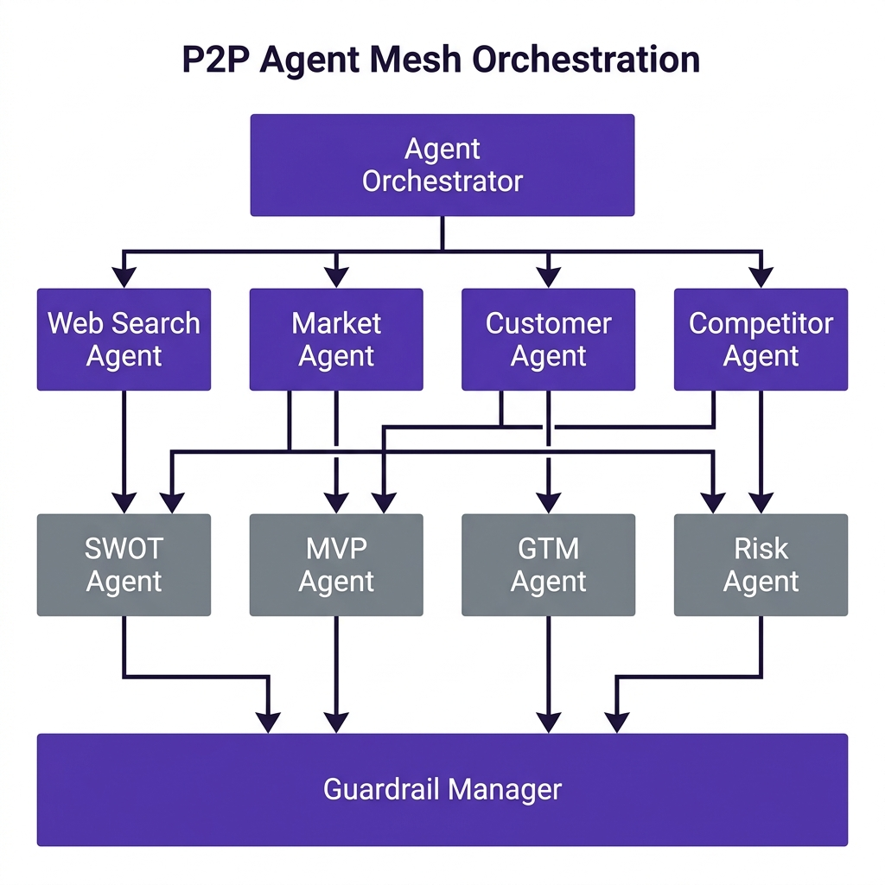

# P2P Agent Mesh Architecture

VentureLens Abandons the traditional linear "Chain" paradigm (e.g., LangChain Sequential Chains) in favor of an asynchronous, fully connected Mesh network.

## 1. Orchestration Diagram

  

## 2. The 10 Specialized Agents (`backend/agents/`)

Every agent is a specialized micro-entity with a strict Persona and Prompt strategy.

1. **`web_search_agent.py`**: Interfaces with Tavily to gather real-time ground-truth data.
2. **`market_agent.py`**: Calculates TAM/SAM/SOM and market trends.
3. **`customer_agent.py`**: Develops buyer personas and pain points.
4. **`competitor_agent.py`**: Maps direct and indirect competitors.
5. **`comparison_agent.py`**: Generates feature matrices.
6. **`swot_agent.py`**: Synthesizes Strengths, Weaknesses, Opportunities, Threats.
7. **`mvp_agent.py`**: Designs the minimum viable product roadmap.
8. **`gtm_agent.py`**: Plans launch channels and Go-To-Market strategies.
9. **`risk_agent.py`**: Identifies regulatory, technical, and market risks.
10. **`startup_score_agent.py`**: Acts as the final judge, assigning the 0-100 viability score.

## 3. Data Flow via Pydantic Contracts (`backend/contracts/`)
Agents do not communicate via unstructured string parsing.
- Each agent must return data that strictly adheres to a predefined Pydantic v2 schema (e.g., `MarketAnalysisSchema`).
- The Orchestrator gathers these schemas, merges them into a massive JSON object, and passes that object to downstream agents (Phase 3 Synthesis).
- This guarantees zero parsing failures in the frontend React application.
