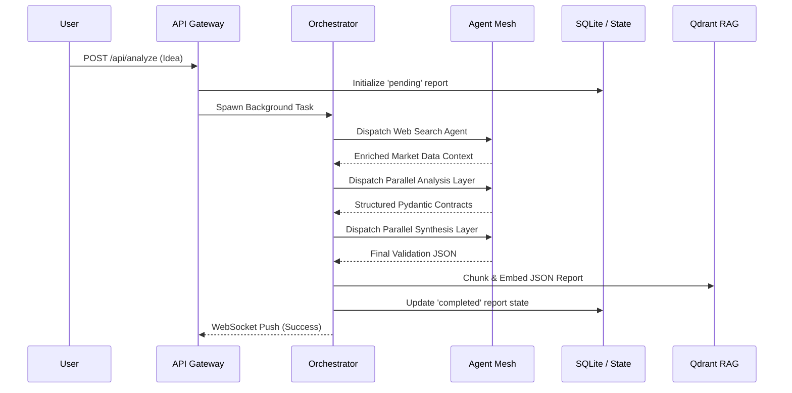
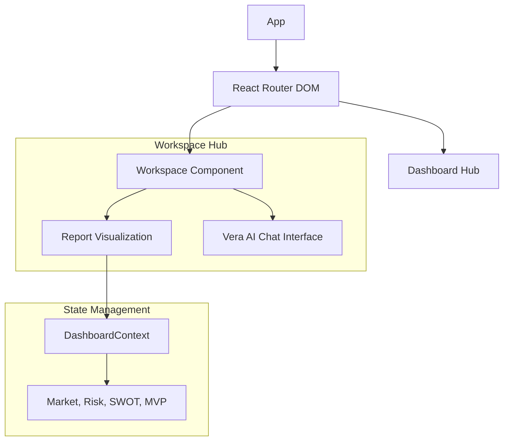
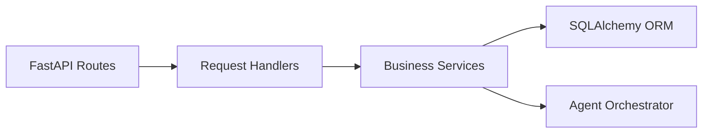
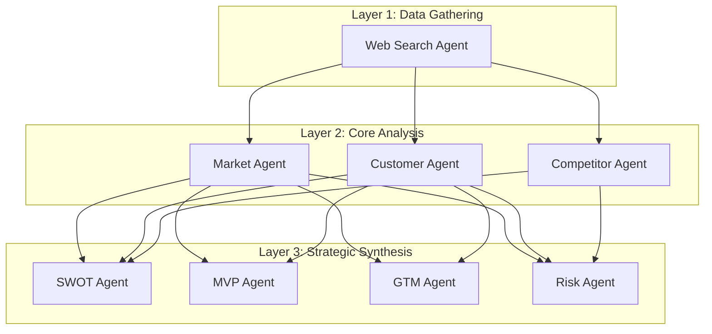
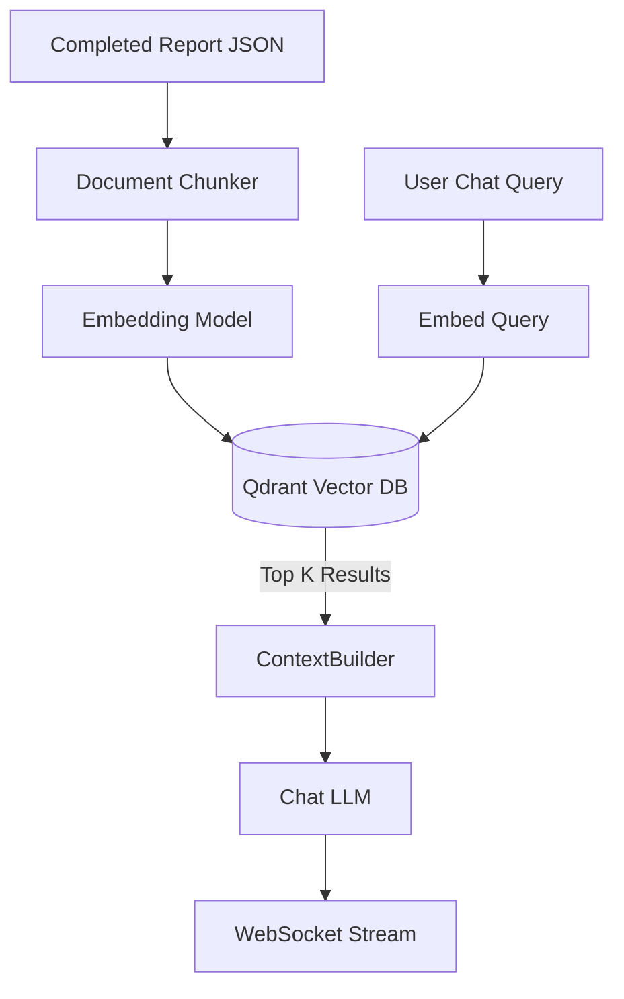
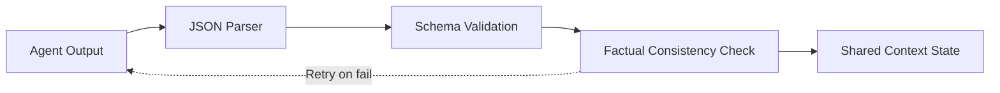
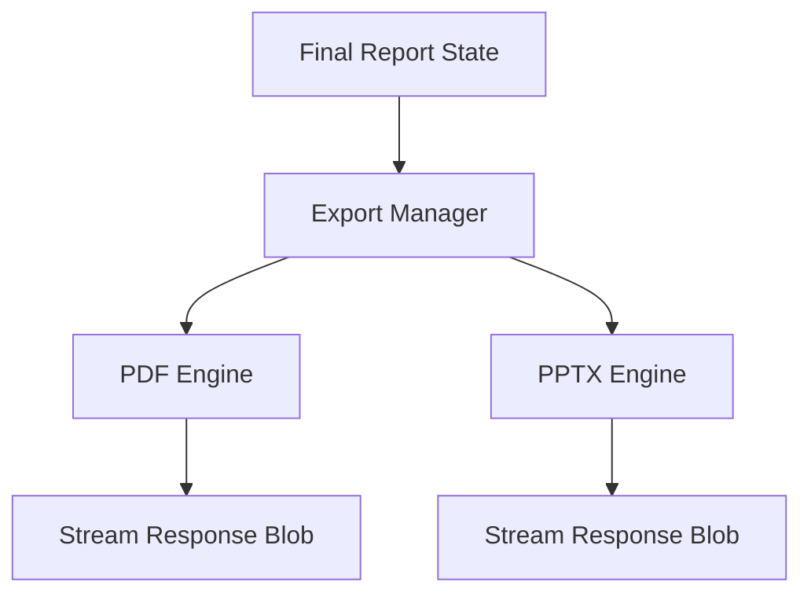
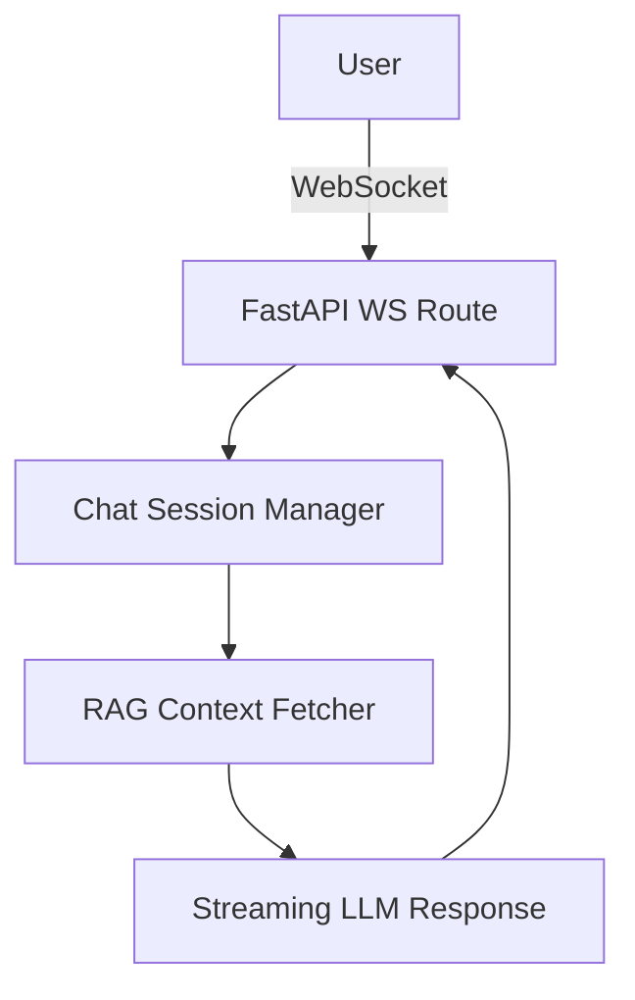
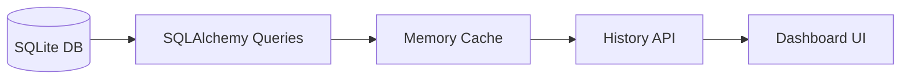

# VentureLens Engineering Architecture

This document provides a deep, technical breakdown of the VentureLens platform architecture.

## 1. High-Level Data Flow Architecture

VentureLens is fundamentally an event-driven system built around a central mesh orchestrator. The data flow guarantees that raw inputs are sanitized, enriched, validated, and finally structured for downstream UI consumption and Vector DB storage.

## 2. Frontend Architecture

The React SPA utilizes a decoupled Context API for state management, allowing isolated renders of heavy data components without blocking the main thread.

## 3. Backend Architecture

FastAPI acts as the API Gateway, managing HTTP requests, background tasks, and WebSockets.

## 4. Agent Architecture (P2P Mesh)

Unlike traditional LLM chains (e.g., LangChain Sequential), VentureLens agents act as independent microservices passing strict Pydantic schemas.

## 5. RAG (Retrieval-Augmented Generation) Architecture

To power the Vera AI system without overwhelming context windows, we use an in-memory Qdrant instance.

## 6. Guardrails & Validation Architecture

Every agent output passes through the Guardrail Manager before being accepted into the shared state.

## 7. Export Architecture

The Export service reads the final JSON state and uses specific render engines.

## 8. Vera AI Architecture

Vera is a WebSocket-driven conversational agent with direct access to the RAG pipeline.

## 9. Workspace Architecture

The workspace handles the persistence and historical tracking of generated ideas.

