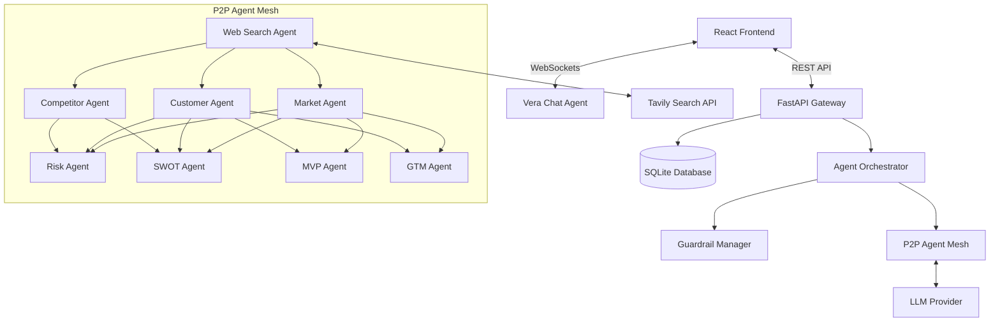
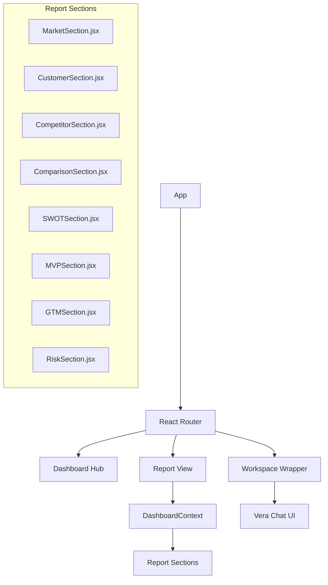
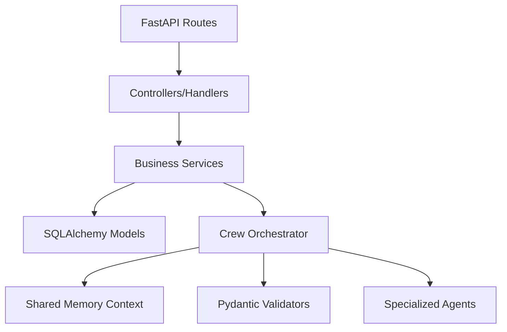
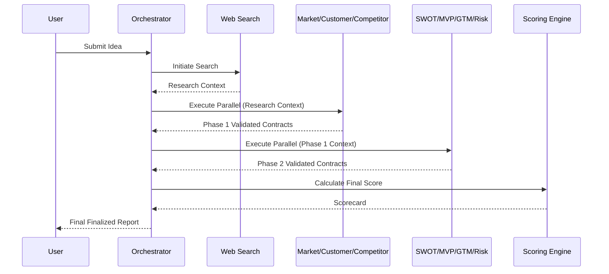
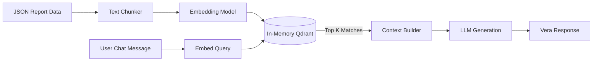
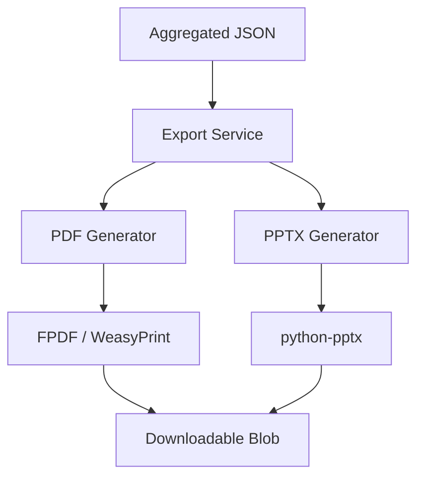

# VentureLens System Architecture

## 1. High-Level System Architecture

VentureLens operates as an asynchronous, event-driven mesh network. The backend is powered by FastAPI, leveraging a decentralized multi-agent system built on asyncio. The frontend is a React SPA built with Vite, communicating over REST and WebSockets.

## 2. Frontend Architecture

The frontend is a component-driven React application utilizing Context API for state management and Framer Motion for animations.

## 3. Backend Architecture

The backend follows a service-oriented architecture, heavily leveraging dependency injection and asynchronous tasks.

## 4. Agent Orchestration Architecture

The orchestration engine uses a Peer-to-Peer (P2P) mesh model where agents directly consume outputs from upstream agents rather than relying on a rigid central controller.

## 5. RAG Pipeline Architecture

The Retrieval-Augmented Generation (RAG) pipeline is utilized exclusively by the Vera Chat agent for context-aware Q&A against the generated report.

## 6. Export Architecture

