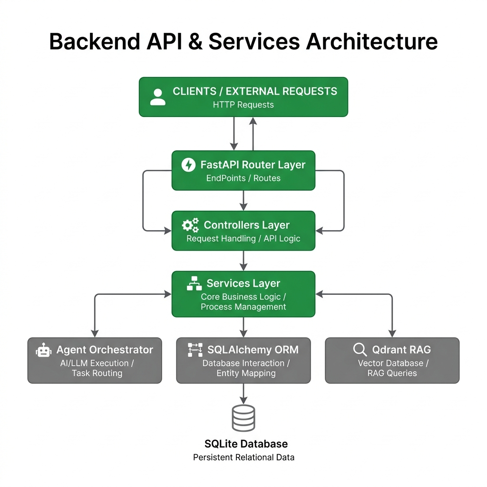

# Backend Architecture Documentation

The VentureLens backend is a high-performance Python API built to orchestrate complex, long-running AI tasks without blocking the main event loop.

## 1. High-Level Diagram

  

## 2. Core Technologies
- **FastAPI**: The ASGI web framework powering REST and WebSocket connections.
- **AsyncIO**: Crucial for running 8+ LLM agents in parallel without locking the server.
- **SQLAlchemy & Alembic**: ORM and migration tracking for persistence.
- **SQLite**: The current lightweight database engine (configurable to PostgreSQL via URL injection).

## 3. Key Architectural Layers

### A. API Gateway (`backend/api/`)
Defines the entry points.
- **`search_routes.py` / `report_routes.py`**: Handles incoming HTTP requests, initiates database state changes, and spawns background tasks.
- **`chat_routes.py`**: Mounts the WebSocket endpoints for the Vera AI interface.

### B. Business Logic & Orchestration (`backend/crew/` & `backend/services/`)
- **`orchestrator.py`**: The heart of VentureLens. It receives a validated idea, executes the Web Search agent, and then branches out into concurrent `asyncio.gather()` calls for Phase 2 and Phase 3 agents.
- **Background Tasks**: Long-running orchestrations are passed to FastAPI's `BackgroundTasks` so the client receives an immediate `202 Accepted` response.

### C. Guardrails (`backend/guardrails/`)
- intercepts data flowing between the LLM agents and the Orchestrator, ensuring it perfectly matches the required Pydantic schema and contains no factual contradictions based on the initial Tavily search context.

### D. Persistence (`backend/database/`)
- SQLAlchemy models define the `Report` table, which stores the `raw_idea`, `status` ('pending' vs 'completed'), and the finalized `report_data` (JSON).
