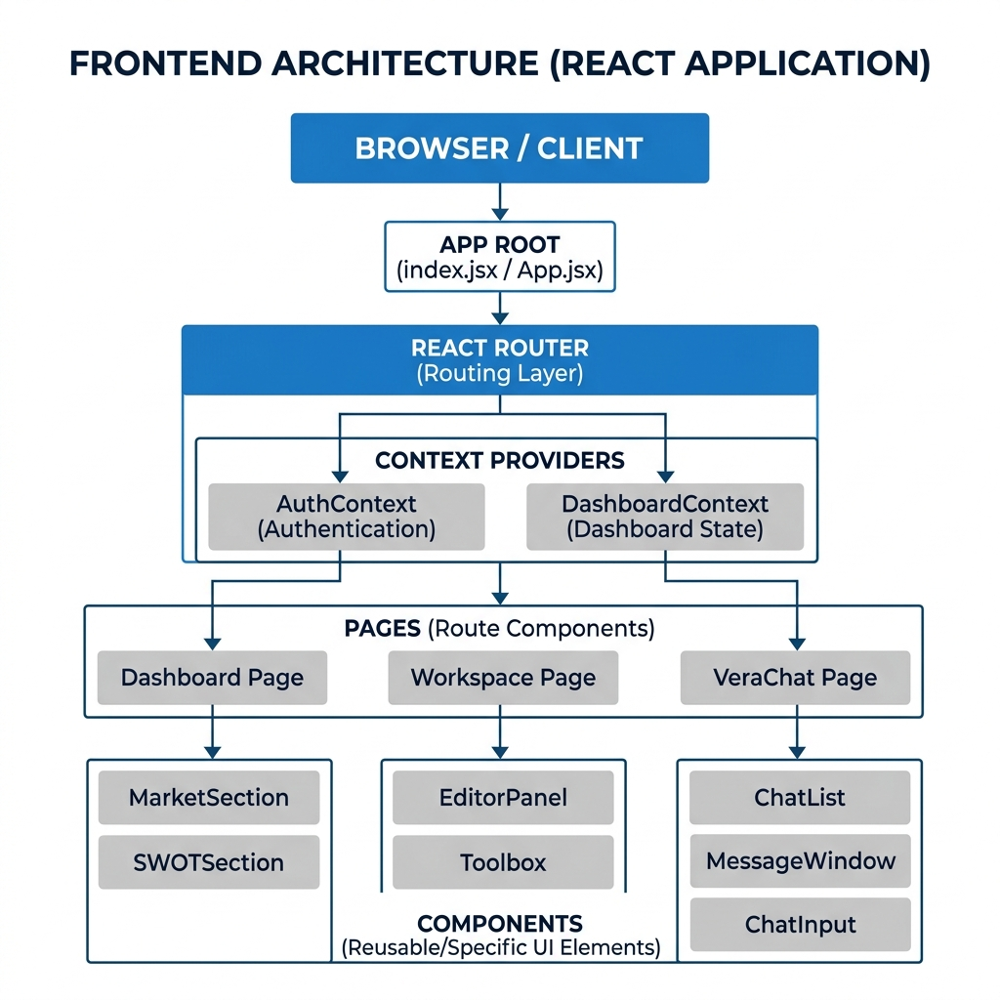

# Frontend Architecture Documentation

The VentureLens frontend is a React 18 Single Page Application (SPA) utilizing Vite for rapid bundling. The architecture is designed to handle complex, deeply nested state (multi-section JSON reports) while maintaining high performance through contextual decoupling and animation optimization.

## 1. High-Level Diagram

  

## 2. Core Technologies
- **React 18 & Vite**: Core framework and bundler.
- **TailwindCSS**: Utility-first styling for a glassmorphic, dark-mode-first design.
- **Framer Motion**: powers the intricate pipeline animations during the report generation phase.
- **Recharts**: For dynamic data visualization in the report sections.

## 3. Key Architectural Layers

### A. Routing & Pages (`src/pages/`)
The application relies on React Router for client-side navigation.
- **Dashboard (`Dashboard.jsx`)**: The primary entry point where users submit startup ideas and view their history.
- **Workspace (`Workspace.jsx`)**: A layout wrapper that fetches a specific report by ID and provides a tabbed interface.
- **VeraChat (`VeraChat.jsx`)**: The interactive WebSocket interface allowing users to converse with their data.

### B. State Management (`src/contexts/`)
Instead of a heavy global store like Redux, VentureLens uses targeted React Contexts:
- **`DashboardContext`**: Manages the state of the currently active report, handling polling logic for the "pending" to "completed" state transition.
- **`AuthContext`** (if implemented): Handles user session states.

### C. Component Modularity (`src/components/`)
The final JSON report is massive. To prevent rendering bottlenecks, it is split into isolated functional components:
- `MarketSection.jsx`, `SWOTSection.jsx`, `RiskSection.jsx`: Each component subscribes only to its specific slice of the context data.

## 4. API & Data Flow
All external communications are abstracted into `src/services/`.
- **REST API (`api.js`)**: Handles POST requests to initiate analysis, GET requests to fetch history, and GET requests to trigger PDF/PPTX exports.
- **WebSockets (`websocket.js`)**: Manages the persistent, bidirectional connection required by the Vera AI Chat interface.
