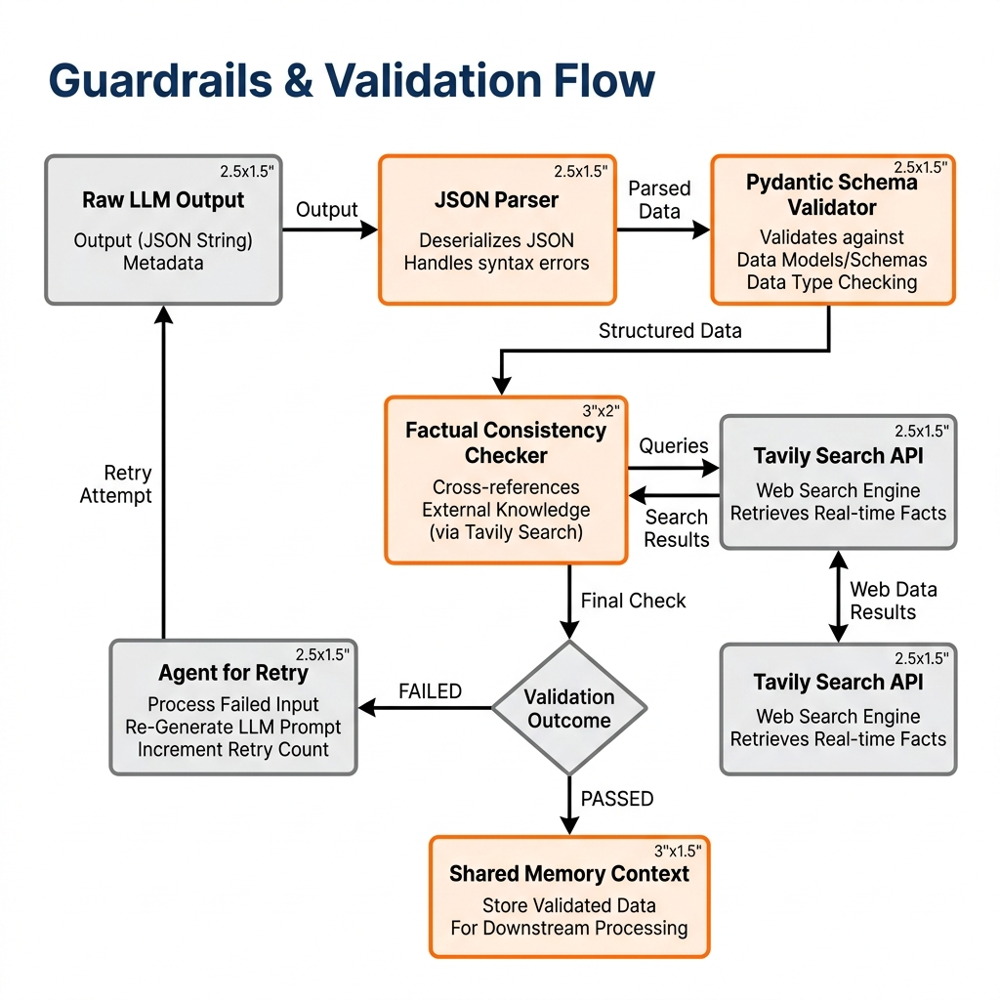

# Guardrails & Validation Architecture

LLMs are prone to hallucination and data malformation. VentureLens solves this at the orchestration layer using a strict Guardrail Manager.

## 1. Validation Flow

  

## 2. The Guardrail Manager (`backend/guardrails/manager.py`)

The manager sits between the LLM output and the Orchestrator's shared context memory.

- **Schema Matching**: It verifies that the JSON emitted by the agent perfectly maps to the expected Pydantic contract.
- **Numeric Matching**: It ensures mathematical claims (e.g., Market Size TAM) are consistent across different sections of the report.
- **Factual Consistency**: It cross-references bold claims against the initial Tavily search context to prevent hallucinated market statistics.
- **Destructive Prevention**: If data is invalid, the manager forces the Agent to retry with a targeted error prompt, rather than blindly deleting or accepting corrupt data.
