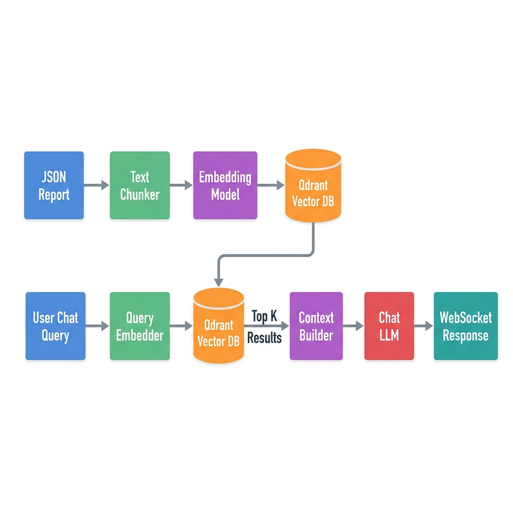

# RAG Pipeline Architecture (Vera AI)

VentureLens incorporates an advanced Retrieval-Augmented Generation (RAG) pipeline to power the Vera AI Co-Founder chat interface.

## 1. RAG Workflow

  

## 2. In-Memory Qdrant Integration (`backend/rag/`)

To keep the platform blazing fast and minimize dependency overhead, VentureLens utilizes an **in-memory instance of Qdrant Vector DB**.

- **Chunking Strategy**: The massive 20+ page JSON report is chunked into logical semantic blocks (e.g., SWOT section, Market section).
- **Embedding**: These chunks are embedded using high-performance text embedding models and stored transiently in Qdrant.
- **WebSocket Streaming**: When a user queries Vera, the `chat_routes.py` WebSocket handler intercepts the query, embeds it, queries Qdrant for the top K matching chunks, and builds a strict context window for the Chat LLM.
- **Result**: The LLM streams its response back to the user via WebSockets in real-time, grounded *entirely* in the data of their specific startup report.
