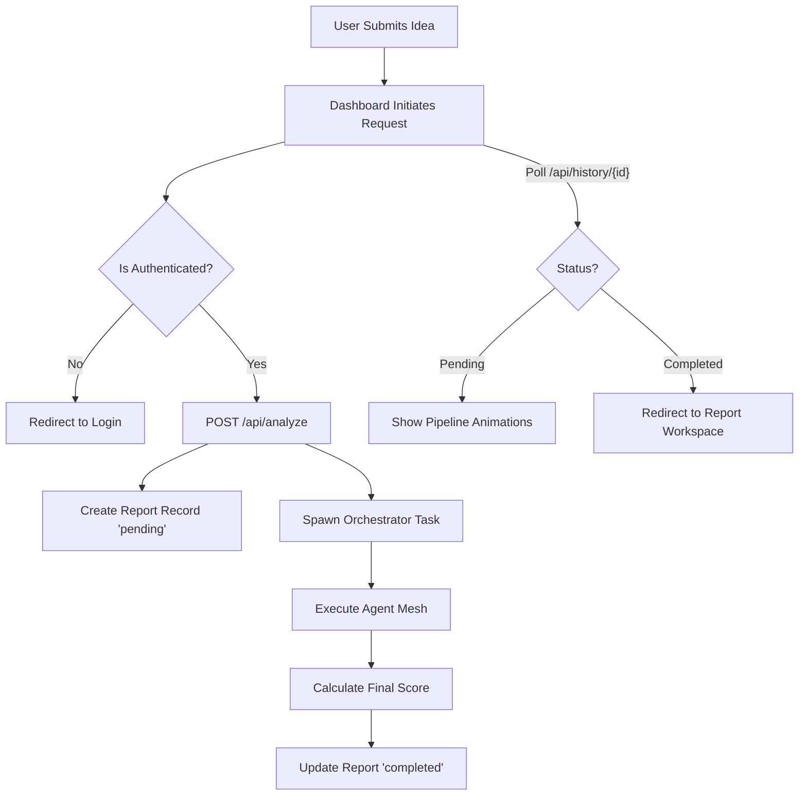
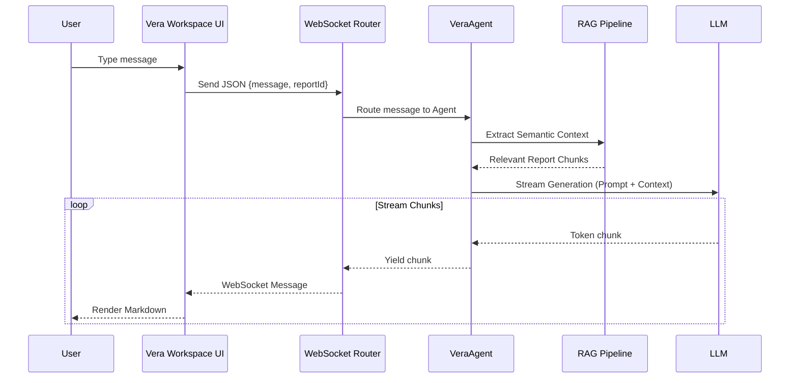
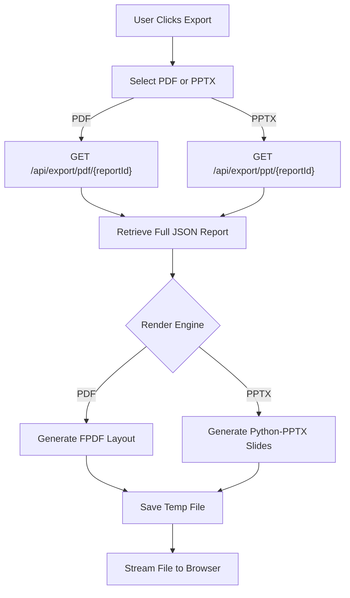

# VentureLens System Workflows

## 1. Startup Validation Workflow

```mermaid
graph TD
    Start["User Submits Idea"] --> Dashboard["Dashboard Initiates Request"]
    Dashboard --> AuthCheck{"Is Authenticated?"}
    
    AuthCheck -->|No| Login["Redirect to Login"]
    AuthCheck -->|Yes| ValidationAPI["POST /api/analyze"]
    
    ValidationAPI --> DB_Insert["Create Report Record 'pending'"]
    ValidationAPI --> BackgroundTask["Spawn Orchestrator Task"]
    
    BackgroundTask --> Mesh["Execute Agent Mesh"]
    Mesh --> Score["Calculate Final Score"]
    Score --> DB_Update["Update Report 'completed'"]
    
    Dashboard -->|"Poll /api/history/{id}"| StatusCheck{"Status?"}
    StatusCheck -->|Pending| PipelineUI["Show Pipeline Animations"]
    StatusCheck -->|Completed| Redirect["Redirect to Report Workspace"]
```

## 2. Vera Chat Workflow

```mermaid
sequenceDiagram
    participant User
    participant UI as Vera Workspace UI
    participant WS as WebSocket Router
    participant Vera as VeraAgent
    participant RAG as RAG Pipeline
    
    User->>UI: Type message
    UI->>WS: Send JSON {message, reportId}
    WS->>Vera: Route message to Agent
    
    Vera->>RAG: Extract Semantic Context
    RAG-->>Vera: Relevant Report Chunks
    
    Vera->>LLM: Stream Generation (Prompt + Context)
    
    loop Stream Chunks
        LLM-->>Vera: Token chunk
        Vera-->>WS: Yield chunk
        WS-->>UI: WebSocket Message
        UI-->>User: Render Markdown
    end
```

## 3. Export Workflow

```mermaid
graph TD
    User["User Clicks Export"] --> ExportModal["Select PDF or PPTX"]
    
    ExportModal -->|PDF| PDF_Route["GET /api/export/pdf/{reportId}"]
    ExportModal -->|PPTX| PPT_Route["GET /api/export/ppt/{reportId}"]
    
    PDF_Route --> FetchDB["Retrieve Full JSON Report"]
    PPT_Route --> FetchDB
    
    FetchDB --> Engine{"Render Engine"}
    
    Engine -->|PDF| FPDF["Generate FPDF Layout"]
    Engine -->|PPTX| PPTX["Generate Python-PPTX Slides"]
    
    FPDF --> Cleanup["Save Temp File"]
    PPTX --> Cleanup
    
    Cleanup --> StreamingResponse["Stream File to Browser"]
```
