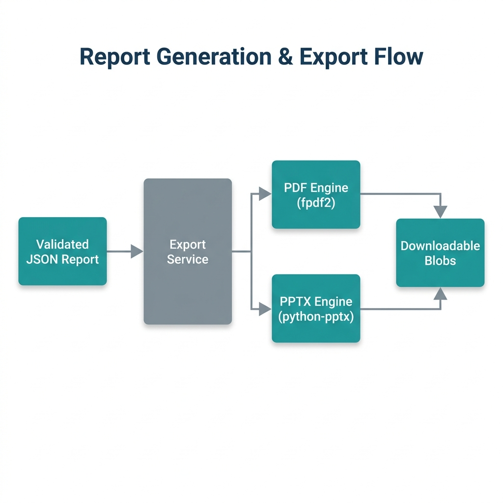

# Workspace & Export Architecture

The Workspace is the primary user interface where the finalized JSON report is visualized and exported.

## 1. Export Flow

  

## 2. Interactive Workspace (`frontend/src/pages/Workspace.jsx`)

- **State Management**: Uses React Context to hold the multi-megabyte JSON payload securely in browser memory.
- **Dynamic Visualization**: Renders complex data using Recharts for market growth curves and custom Framer Motion components for SWOT matrices.

## 3. Export Engines (`backend/export/`)

The JSON report is highly structured, allowing for deterministic exports.

- **PDF Engine (`fpdf2`)**: Dynamically paginates the JSON sections into a professional, heavily formatted Executive Summary PDF.
- **PPTX Engine (`python-pptx`)**: Maps specific JSON arrays (like Competitor matrices and SWOT points) directly into PowerPoint slide templates, generating an investor-ready Pitch Deck in milliseconds.
